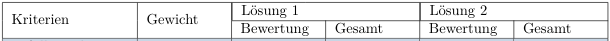

## Cheatsheet

### Tables

Example of a table with 4 Columns an 2 Rows.

```tex
\begin{table}[h!]
    \begin{tabular} {|L{0.1\textwidth}|L{0.23\textwidth}|L{0.23\textwidth}|L{0.33\textwidth}|}
        \hline
        \rowcolor{puzzleblue}Version & Datum & Name & Beschreibung \\[11pt]
        \hline
        Vorlage & 07.11.2019 & Sylvain Gilgen & Dokumentvorlage V1.0\\
        \hline
    \end{tabular}
    \caption{Änderungsprotokoll}
\end{table}
```

The `\begin{table} ` is needed so the Table can have a `\caption` for the `\listoftables`.
These are some options for positioning `\table`:

h:   Will place the table here approximately.

t:   Position the table at the top of the page.

b:    Position the table at the bottom of the page.

p:   Put the table in a special page, for tables only.

!:    Override internal LaTeX parameters.

H:    Place the table at this precise location, pretty much like h!.

```tex
\begin{tabular} {|L{0.1\textwidth}|L{0.23\textwidth}|L{0.23\textwidth}|L{0.33\textwidth}|} 
```

This line defines the amount of columns, width of each column, textorientation of each column and seperater between columns.
For textorientation there are a few options:

t: 	the line at the top is aligned with the text baseline

b: 	the line at the bottom is aligned with the text baseline

c or none: 	the table is centred to the text baseline

l: 	left-justified column

r: 	right-justified column

p{'width'}: 	paragraph column with text vertically aligned at the top

m{'width'}: 	paragraph column with text vertically aligned in the middle (requires array package)

b{'width'}: 	paragraph column with text vertically aligned at the bottom (requires array package) 

L{'width'}: left-justified column with width adjustment

C{'width'}: the table is centred to the text baseline with width adjustment

R{'width'}: right-justified column with width adjustment

``` tex
\renewcommand{\arraystretch}{4}
```
Changes the row height to 4 normal is 1
``` tex
\begin{tabular}{*{6}{|L{0.16\textwidth}}}
```
Creates a table with 6 rows with the same formatting

``` tex
\rowcolors{2}{puzzleblue!30}{white}
```
Colors the table in alternating colors. Comes between `\table` and `\tabular`

`\cellcolor{puzzleblue!50}` changes the color of one cell. The `!50` is for the Alpha value of the color

`\rowcolor{puzzleblue}` changes the color of the whole row

`\multicolumn{2}{|l|}` lets you combine columns

```tex
\hline
\multirow{2}*{Kriterien} & \multirow{2}*{Gewicht} & \multicolumn{2}{|l|}{Lösung 1 } & \multicolumn{2}{|l|}{Lösung 2} \\
\cline{3-6}
& & Bewertung & Gesamt & Bewertung & Gesamt \\  
\hline
```
Creates this:



links: 
* https://www.overleaf.com/learn/latex/Positioning_images_and_tables
* https://www.overleaf.com/learn/latex/Tables